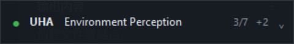

> Historical documentation: UAH is disabled in this publication snapshot and deferred to the next release.

> Publication copy: personal user/evidence paths are redacted. Historical test results are unchanged; raw evidence remains private.

> Publication copy: personal user/evidence paths are redacted. Historical test results are unchanged; raw evidence remains private.

# UAH Phase 1.1 交付报告

## 2026-09-22 最终安全收尾（本节为最新结论）

本机受支持路径 P0 验收 PASS；P4B 安全阻塞已解除（UNBLOCKED）。本机 v0.1 为 READY WITH KNOWN ISSUES；公开发布未批准、历史秘密审计未完成。已完成三项真人适配器链路验收，后续 hook/资源清理增强通过 76 项真实 OS 故障与清理检查、完整适配器自动回归及十组全回归。140 Python 文件 syntax failures=0。

完整修复、失败保留、准确命令、有限延迟及未验证边界见 P0_1_FINAL_VALIDATION_REPORT.md。以下 BLOCKED/NOT READY 是此前阶段历史结论，不再代表本节定义的本机受支持范围。


## 2026-09-22 回归补充

Compact 实际窗口再次通过模式/尺寸/无激活/拖动/多 Agent/持久化/提醒/Hub 重连测试，进程退出 0；旧 Dashboard 19 项、selftest 11 项、Phase1.1 本地审批等 16 项通过。一次并行 GUI 的焦点失败日志保留，隔离重跑通过。UAH 日常小 HUD 仍是本机已测范围 PASS；新版输入安全验收 PARTIAL，P4B BLOCKED，不能与下方历史 FAIL 或后续软件自动 PASS 混为同一结论。

本轮保留现有正式 progress hook、独立 Hub、可配置审批、shared Protocol/Status/Render。没有伪造 WAITING_INPUT，也没有为了统一 UI 重写安全 Banner/ControlOverlay。

---

日期：2026-09-21；仓库 `E:/UnrealHybridAgent`。

**日常常驻小 HUD 基础能力：PASS（本机已测范围）。P0 Computer Use 安全验收：FAIL，P4B 仍 BLOCKED。两者互不替代。**

## 1. 产品形态与实际效果

默认切换为 320×48 的 Compact 状态条：无原生标题栏、置顶、可拖动；仅状态点、Agent、主要动作、进度与 +N 切换。不是纵向多卡片默认页。背景深色，状态色只作用于小点与提醒细边框。



截图来自真实 Windows 窗口；系统 150% 缩放下物理截图 480×72，对应逻辑尺寸 320×48。截图仅使用独立样例 Hub，不冒充真实任务进度。

- 单击右侧箭头：Compact ↔ Expanded。Expanded 320×216，显示共享渲染模型中的 Task / Stage / Step / Activity / Tool / elapsed；长文本在小窗口内截短。
- Expanded 的 Dashboard 按钮或右键菜单：进入原 320×640 多卡片调试视图。右键菜单可切回任一模式、静音、关闭。
- +N 按钮轮换 Agent；需要注意的事件自动选中相关 Agent，不堆叠窗口。
- 模式、位置、所选 Agent 写入 `.state/uah/window.json`，静音沿用 `.state/uah/notify.json`。默认 Compact，仍尊重用户后续保存的模式。
- 断线在小条标明离线；重连使用新 Hub 全量快照，清除新快照中不存在的旧 Agent。Hub 硬重启不恢复历史数据库，需 Agent 重新上报。
- 窗口使用 NOACTIVATE；实际启动与提醒前后前台句柄检查通过。提醒保持非模态，后台提示音/通知沿用已有 Notifier。
- 默认位置和拖动限制避开屏幕顶部前 110 逻辑像素；提醒不 lift 到 Safety Banner 上方。任意自定义 safety banner 位置、多屏工作区和特殊 DPI 仍未做完整兼容性验收。

## 2. 架构与 Single Source of Truth

保留 `Protocol → StateStore / Hub → Native Adapter → shared render_card / Notifier → hosts`。UAH 状态枚举仍仅在 `uah/core/models.py`，状态归并仍使用现有 StateStore，颜色/徽标/行信息使用 shared CardView。Compact/Expanded 是宿主布局，Dashboard 原实现保留为 DashboardApp。没有复制另一套 Agent 状态机。

P0 SafetyState 表达注入许可，UAH Status 表达任务状态；保持语义隔离。HUD 没有暂停/恢复 P0 的权力，不是安全机制。未迁移 ControlOverlay：当前 Agent venv 无 tkinter，且不为视觉统一改动原控制层；既有 embedded 日志与共享渲染继续工作。

## 3. 正式 Executor progress hook

`Executor.add_progress_listener()` 发出 begin / step / end / single。监听异常被隔离，不改变执行结果；计划异常也在 finally 发出失败 end。UHA Adapter 订阅正式 API，已去掉对 `run_plan` / `run` 的运行时替换。

真实 CLI dry-run 的 JSONL 记录出现 1/3 → 2/3 → 3/3 → DONE → 进程退出，且 plan_hooks 标注正式 hook。原 UHA 全回归保持通过。这是 dry-run 语义进度验证，不是 UE 真实场景修改验收。

## 4. 本机审批通道

新增 `uah/core/approval.py`。仅在配置 `uah.local_approval.enabled=true` 且没有已有 confirmer 时接入；默认关闭。例：

```json
{"uah":{"local_approval":{"enabled":true,"timeout_s":60}}}
```

审批仍由原 ApprovalGate 决定是否需要询问；硬拒绝和 AUTO 规则不被绕过，只有 CONFIRM 请求可进入新交互通道。WAITING_APPROVAL 只在真实 confirmer 等待时发出；未配通道的既有 BLOCKED 语义保留。WAITING_INPUT 没有新增虚假的触发点。

请求使用随机 req_id，重复/已消费 id 拒绝，超时默认拒绝，断连/异常默认拒绝。Hub 重启使旧令牌和旧请求失效，不能把旧批准复用到新请求。HUD 在 Expanded 展示 Approve / Reject，并在后台提交决定，不阻塞 Tk。

端点仅接受 loopback 来源、拒绝浏览器 Origin、校验本地 capability token；令牌文件已加入 gitignore。它面向同一 Windows 用户的可信本机进程，不声称提供跨 Windows 账户的完整隔离。Broker 达 10000 个请求历史条目后保守拒绝，重启 Hub 后重新建立请求。

真实 HTTP 测试验证允许、拒绝、重复 req_id、重复决定、超时、断线、错误令牌、Origin、AUTO/硬拒绝。实际 Tk 按钮 invoke 测试走到 Hub，并验证读出的决定确实为 False / True；这是 GUI 自动化，未执行任何真实 UE mutation。

## 5. 持久 Hub 与退出

`uah/core/daemon.py` 负责独立 Hub。HUD 直接入口和 UHA bootstrap 都会在需要时启动独立、隐藏控制台的 Hub 进程，父 Agent 退出不停止 Hub。真实进程测试在 launcher 已退出后再次访问 Hub，验证 PID 一致且仍健康。

没有增加手机、账号、云端或数据库。Hub 硬重启后的历史仅依靠 Agent 重发；SSE 可自动重连。默认 CLI 启动：

```powershell
cd E:\UnrealHybridAgent
.\.venv\Scripts\python.exe -m uah.tools.uah hud
```

图形入口自动选择带 tkinter 的系统 Python。直接用系统 Python 可加 `-m uah.hosts.desktop --mode compact|expanded|dashboard`。

真实冒烟发现 Windows SSE 阻塞读取在 socket shutdown 后仍可能延迟结束。现使用 1 秒 SSE 注释心跳作有界唤醒，HUD 关闭主动断流并 join；定时器句柄列表也改为仅保留有效项，避免每日运行积累。

本机 Tcl 的 DLL 收尾曾连 os._exit 都挂起。最终产品在显式完成取消回调、断流/join、保存设置、销毁窗口、刷新输出后，仅 TerminateProcess 自己的 HUD 进程，独立 Hub 不受影响。GUI 验收同时检查线程已结束和进程 exit=0。新增必须落盘的资源仍须放进 close()，不能依赖模块 atexit。

## 6. 验收与性能

| 验收 | 结论 | 实际结果 |
|---|---|---|
| 原 Phase 1 | PASS | 152/152，含共享模型、状态和重连回归 |
| UHA + P0 原全部回归 | PASS | 原十组总 571/571，所有 exit=0 |
| 新增回归 | PASS | 16/16：审批、安全失败路径、Hub 生命周期、终态重启、损坏 gate |
| 旧 GUI smoke | PASS | 19/19，显式 Dashboard 模式；真实窗口 exit=0 |
| Compact GUI smoke | PASS | 实际 320×48、frameless、topmost、NOACTIVATE、拖动、三态、多 Agent、模式/位置、通知、真实审批按钮、Hub 重启、SSE 线程结束、进程退出 |
| selftest | PASS | 真实 POST/SSE 11/11 |
| Executor CLI | PASS | dry-run 三步计划与完整进度日志；exit=0 |
| 全仓语法 | PASS | 127 个仓库 Python 文件，syntax failures=0 |
| 长时间驻留、多显示器/热插拔、所有 DPI | NOT VERIFIED | 没把短时 GUI smoke 解释为数日稳定性证明 |
| P0 / P4B 安全 | FAIL | 真实 mid-action 和 Agent/控制器 crash 故障仍在；详见另报告 |

性能是 **Hub + 1 SSE 订阅者** 的实际测量，不是完整 Tk HUD 占用：idle 6 秒 CPU 0.00%，Working Set 31.5 MB；running CPU 2.18%，31.6 MB；POST→SSE 中位 1.20 ms、P95 16.34 ms；render_card 平均 0.004 ms。完整 GUI 的长期 CPU/内存剖析仍 NOT VERIFIED。

## 7. 限制与下一步

小 HUD 已达到本机基础日常使用验收；外观为紧凑深色状态条，尚无完整圆角皮肤系统/托盘自启动向导。旧 Dashboard 可手动进入，未删除。审批必须先明确开启配置；没有配置时不会替用户批准。

下一步优先级：先修 P0 后端逐步取消与独立崩溃回收，再做人手物理验收；之后再做长时间驻留、多屏/DPI、可选 ControlOverlay 迁移。不能因为 HUD 好用了就解除 P4B 阻塞。

源代码已实际写入项目；用户此前的未提交工作保留。仓库报告与本交付副本内容相同，原报告保留供对照。


## 实际命令、退出码与日志

工作目录均为 `E:/UnrealHybridAgent`。以下为实际子进程命令；完整 argv、耗时及日志路径也保存在各 JSON 清单。命令中的 `.venv` 指项目 Python 3.13，GUI 使用系统 Python 3.12.10。

- `E:\UnrealHybridAgent\.venv\Scripts\python.exe tests/test_offline.py` — exit=0，248/248，0.96 s；日志 `evidence/validation-final_verified/tests_test_offline.py.log`。
- `E:\UnrealHybridAgent\.venv\Scripts\python.exe uah/tests/test_uah_phase1.py` — exit=0，152/152，21.43 s；日志 `evidence/validation-final_verified/uah_tests_test_uah_phase1.py.log`。
- `E:\UnrealHybridAgent\.venv\Scripts\python.exe tests/test_phase2.py` — exit=0，85/85，1.06 s；日志 `evidence/validation-final_verified/tests_test_phase2.py.log`。
- `E:\UnrealHybridAgent\.venv\Scripts\python.exe tests/test_router.py` — exit=0，25/25，0.14 s；日志 `evidence/validation-final_verified/tests_test_router.py.log`。
- `E:\UnrealHybridAgent\.venv\Scripts\python.exe tests/test_p01_override_survival.py` — exit=0，16/16，0.63 s；日志 `evidence/validation-final_verified/tests_test_p01_override_survival.py.log`。
- `E:\UnrealHybridAgent\.venv\Scripts\python.exe tests/test_phase4.py` — exit=0，13/13，0.47 s；日志 `evidence/validation-final_verified/tests_test_phase4.py.log`。
- `E:\UnrealHybridAgent\.venv\Scripts\python.exe tests/test_phase3.py` — exit=0，11/11，0.25 s；日志 `evidence/validation-final_verified/tests_test_phase3.py.log`。
- `E:\UnrealHybridAgent\.venv\Scripts\python.exe tests/test_p0_safety.py` — exit=0，9/9，0.3 s；日志 `evidence/validation-final_verified/tests_test_p0_safety.py.log`。
- `E:\UnrealHybridAgent\.venv\Scripts\python.exe tests/test_p01_human_override.py` — exit=0，6/6，3.12 s；日志 `evidence/validation-final_verified/tests_test_p01_human_override.py.log`。
- `E:\UnrealHybridAgent\.venv\Scripts\python.exe tests/test_phase4b.py` — exit=0，6/6，0.44 s；日志 `evidence/validation-final_verified/tests_test_phase4b.py.log`。

附加验收：

- `E:\UnrealHybridAgent\.venv\Scripts\python.exe uah/tests/test_phase11.py` — exit=0，6.72 s；日志 `evidence/checks/phase11_verified.log`。
- `C:\Users\PUBLIC_USER\AppData\Local\Programs\Python\Python312\python.exe uah/tests/gui_smoke.py` — exit=0，6.0 s；日志 `evidence/checks/gui_dashboard.log`。
- `C:\Users\PUBLIC_USER\AppData\Local\Programs\Python\Python312\python.exe uah/tests/compact_smoke.py` — exit=0，11.24 s；日志 `evidence/checks/compact_final_verified.log`。
- `E:\UnrealHybridAgent\.venv\Scripts\python.exe -m uah.tools.uah selftest` — exit=0，0.55 s；日志 `evidence/checks/selftest.log`。
- `E:\UnrealHybridAgent\.venv\Scripts\python.exe uah/tests/perf_probe.py` — exit=0，13.61 s；日志 `evidence/checks/performance.log`。
- `E:\UnrealHybridAgent\.venv\Scripts\python.exe uha.py demo1 --actor Hall_Floor --delta 20 --dry-run` — exit=0，8.15 s；日志 `evidence/checks/cli_progress.log`。
- `E:\UnrealHybridAgent\.venv\Scripts\python.exe <PRIVATE_EVIDENCE_PATH>` — exit=0，1.19 s；日志 `evidence/checks/diagnostics.log`。
- `NO_PROXY=127.0.0.1,localhost E:\UnrealHybridAgent\.venv\Scripts\python.exe -m tools.p01_override_demo` — exit=0，2.84 s；日志 `evidence/checks/live_no_proxy.log`。
- `C:\Users\PUBLIC_USER\AppData\Local\Programs\Python\Python312\python.exe uah/tests/live_scratch.py` — exit=1，13.77 s；日志 `evidence/checks/live_scratch_crash.log`。
- `E:\UnrealHybridAgent\.venv\Scripts\python.exe tools/p01_lifecycle_revalidation.py` — exit=1，2.71 s；日志 `evidence/checks/lifecycle_verified.log`。

语法：`E:/UnrealHybridAgent/.venv/Scripts/python.exe <PRIVATE_EVIDENCE_PATH>`，exit=0；逐文件调用 `py_compile.compile(..., doraise=True)`，127 个仓库 Python 文件，**syntax failures=0**。范围为所有 Git 跟踪及未忽略的新 Python 文件；不编译外部 `.venv` 依赖。清单 `evidence/compile.json`。`git diff --check` exit=0。


## 人工验证补记（2026-09-21 晚）

用户已亲自完成动作间鼠标与键盘接管，并分别确认可自由移动、按 Shift 后正常打字；软件日志对应 HUMAN_OVERRIDE、拒绝后续注入及拒绝三次重开。两项限定范围为 PASS / HUMAN VERIFIED，详见安全报告补记。动作中撤销及崩溃回收的 FAIL 不变，P4B 仍 BLOCKED。
